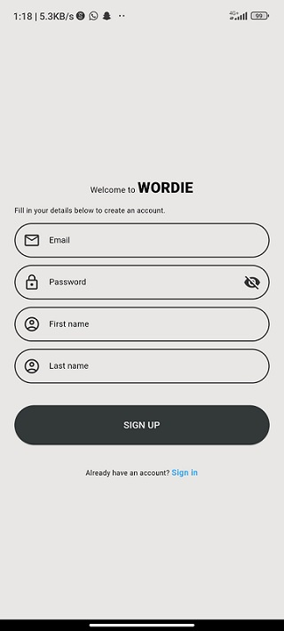
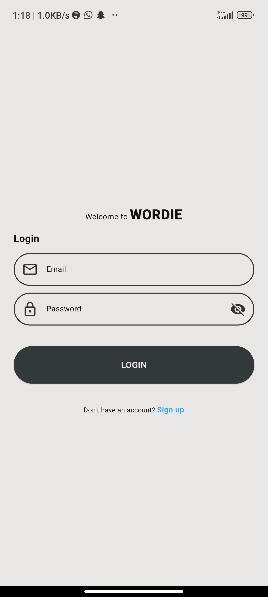
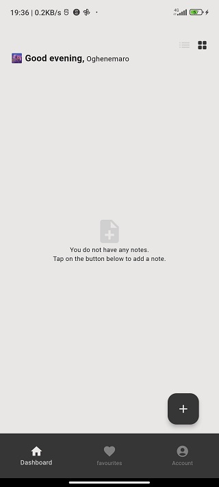
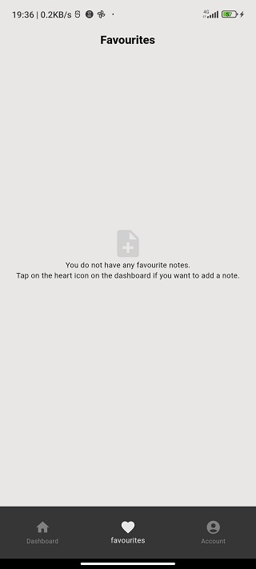
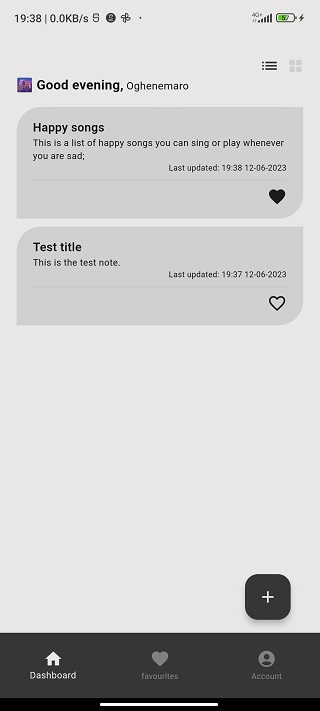
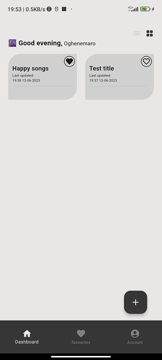
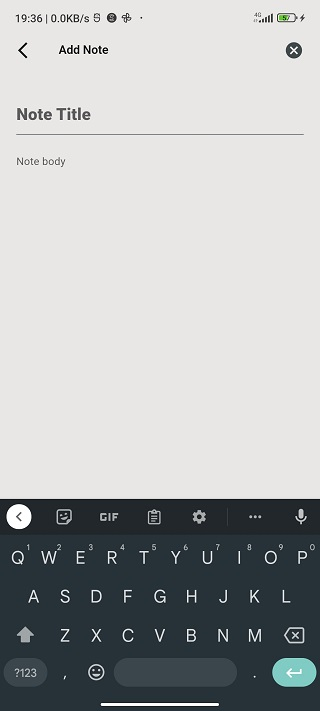
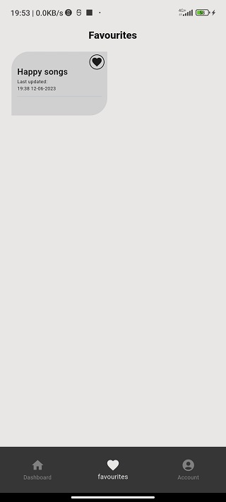
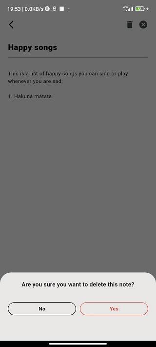

# Wordie

Welcome to Wordie, a notes app built with flutter.

## Getting Started

The first step to testing or running this app is getting the code

    git clone https://github.com/maroafenogho/wordie.git
    .
    .
    flutter pub get

Run the app to confirm that everything works
    
    flutter run

## App Features

The app uses the feature-first architecture. The folder structure for the project is:

    lib/src/features/📁data
                           /📁services/note_service.dart
                           /📁repository/note_repo.dart
                    /📁domain/note_model.dart
                    /📁presentation/📁screens/note_screen.dart
                                   /📁controllers/note_controller.dart

<a href="https://pub.dev/packages/flutter_riverpod">Riverpod</a> is used for state management, <a href="https://pub.dev/packages/go_router">go_router</a> for navigation, firebase for authentication and realtime database.

Each <strong>service.dart</strong> file contains code to query Firebase or carry out authentication calls. The data retrieved fron the network call is parsed to the <strong>repo.dart</strong> class. The controller class receives the data from the repo and in turn determines what the user sees.

### User Authentication

When you run the app for the first time, you will be directed to the login page. As a new user, you would have to navigate to the sign-up page by tapping on the signup botton. 
User registration is achieved by using the *createUserWithEmailAndPassword()* method from firebase. When a user is successfully registered, the entered name is used to update the user's display name and a verification email is sent while the app navigates to the Login screen. The login logic prevents users who have not verified their email addresses from gaining access.

 
 
 
 
 
 
 

# What you can learn from this repo
1. Riverpod state management and dependency overrides
2. go_router
3. Custom widgets
4. Firebase authentication
5. Firebase database
6. Feature-first Architecture
7. Shared preferences
8. Dart extension and more